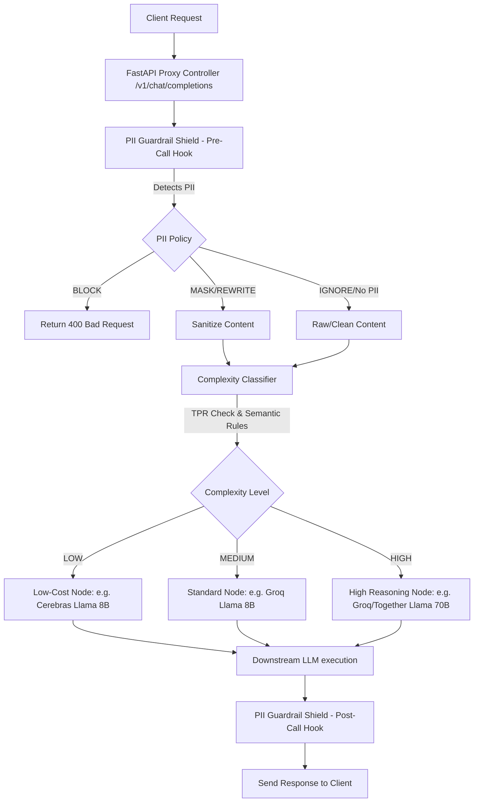

# LiteLLM Load-Balancing & Routing Proxy Server

An enterprise-grade, class-based (OOP) microservice designed for intelligent load balancing, complexity-aware dynamic routing, rate-limit management (TPM/RPM), context-window filtering (TPR), priority preference controls, and real-time PII shielding with local fine-tuning support.

Built using **FastAPI**, **LiteLLM**, **Pydantic**, and **Streamlit**, this proxy server abstracts backend topologies (Groq, Cerebras, Together AI, and local Ollama) into a high-availability, OpenAI-compatible gateway.

---

## 🚀 Key Features

1. **Class-Based (OOP) Architecture**
   - Fully encapsulated components: [ProxyConfig](file:///Users/sanvijain/Downloads/litellm%20deployed/LiteLLM_Proxy-f39e1624a1ad0a568d17ba063799188b882327cc/proxy/config.py), [LiteLLMProxyRouter](file:///Users/sanvijain/Downloads/litellm%20deployed/LiteLLM_Proxy-f39e1624a1ad0a568d17ba063799188b882327cc/proxy/router.py), and [LiteLLMProxyApp](file:///Users/sanvijain/Downloads/litellm%20deployed/LiteLLM_Proxy-f39e1624a1ad0a568d17ba063799188b882327cc/proxy/app.py) designed for clean dependency injection and testing.

2. **Complexity-Aware Multi-Tier Routing**
   - Classifies user queries dynamically into **Low**, **Medium**, and **High** complexity based on context lengths (>8K context is auto-classified as high) and semantic logic indicators (code/math/logic/analysis).
   - Routes requests to optimal physical backends matching the target complexity tier to minimize credit spend.

3. **Tokens Per Request (TPR) Context Escalation**
   - Estimates prompt token size using `tiktoken` to prevent context overflow rejections, automatically cascading/escalating large-context prompts to high-capacity nodes (e.g. Together AI 70B).

4. **Real-Time PII Guardrail Shield**
   - Uses a local **DeBERTa-v3 token classification pipeline** ([Isotonic/deberta-v3-base_finetuned_ai4privacy_v2](https://huggingface.co/Isotonic/deberta-v3-base_finetuned_ai4privacy_v2)) to detect PII (names, emails, phones, SSNs, credit cards, etc.).
   - Remediates detected entities using configurable action rules: `MASK`, `BLOCK`, `REWRITE` (leveraging Ollama/Mistral), or `IGNORE`.

5. **Priority-Based Preference Routing & Budgets**
   - Allows users to set a customized model priority hierarchy (e.g., preference for Groq over Cerebras).
   - Monitors model credit consumption in real-time, automatically falling back to lower-priority nodes or zero-cost local Ollama when budget limits are exceeded.

6. **DeBERTa Supervised Fine-Tuning API**
   - Features dedicated public API endpoints to trigger asynchronous training runs on custom domain data and check training status/logs.
   - Automatically reloads model weights across active pipelines on successful completion.

---

## 📊 Request Flow Architecture



---

## 📁 Repository Structure

- [config.yaml](file:///Users/sanvijain/Downloads/litellm%20deployed/LiteLLM_Proxy-f39e1624a1ad0a568d17ba063799188b882327cc/config.yaml): Model catalog, clusters, metrics, fallbacks, and complexity settings.
- [proxy/app.py](file:///Users/sanvijain/Downloads/litellm%20deployed/LiteLLM_Proxy-f39e1624a1ad0a568d17ba063799188b882327cc/proxy/app.py): Core FastAPI web controller and endpoint routes.
- [proxy/router.py](file:///Users/sanvijain/Downloads/litellm%20deployed/LiteLLM_Proxy-f39e1624a1ad0a568d17ba063799188b882327cc/proxy/router.py): Dynamic routing engine, complexity classifier, and preference controller.
- [proxy/config.py](file:///Users/sanvijain/Downloads/litellm%20deployed/LiteLLM_Proxy-f39e1624a1ad0a568d17ba063799188b882327cc/proxy/config.py): Configuration parser converting yaml specifications into Pydantic settings.
- [guardrails/deberta_pii_guardrail.py](file:///Users/sanvijain/Downloads/litellm%20deployed/LiteLLM_Proxy-f39e1624a1ad0a568d17ba063799188b882327cc/guardrails/deberta_pii_guardrail.py): DeBERTa-v3 NER pipeline wrapper, remediation strategies, and supervised fine-tuning loops.
- [app.py](file:///Users/sanvijain/Downloads/litellm%20deployed/LiteLLM_Proxy-f39e1624a1ad0a568d17ba063799188b882327cc/app.py): Unified Streamlit enterprise Gateway & Fine-Tuning console.
- [main.py](file:///Users/sanvijain/Downloads/litellm%20deployed/LiteLLM_Proxy-f39e1624a1ad0a568d17ba063799188b882327cc/main.py): Server startup script loading ASGI Uvicorn workers.
- [test_proxy.py](file:///Users/sanvijain/Downloads/litellm%20deployed/LiteLLM_Proxy-f39e1624a1ad0a568d17ba063799188b882327cc/test_proxy.py): OOP-based unit and integration test suite.
- [.env](file:///Users/sanvijain/Downloads/litellm%20deployed/LiteLLM_Proxy-f39e1624a1ad0a568d17ba063799188b882327cc/.env): Active server configuration credentials.

---

## 🛠️ Getting Started

### 1. Environment Configurations
Instantiate a `.env` file in the root workspace directory matching this structure:
```env
PORT=8000
HOST=0.0.0.0

# API Credentials (leave as mock placeholder to activate mock sandbox fallback)
GROQ_API_KEY=gsk_...
CEREBRAS_API_KEY=csk-...
TOGETHERAI_API_KEY=tgp_...
OLLAMA_API_BASE=http://localhost:11434
```

### 2. Startup Execution

**Start the FastAPI Routing Backend**:
```bash
python3 main.py
```
*Loads the router on `http://localhost:8000`.*

**Start the Streamlit Console**:
```bash
PORT=8000 streamlit run app.py
```
*Fires the frontend dashboard on `http://localhost:8502` linked to the proxy.*

---

## 🔌 API Documentation

### OpenAI Completions Gateway
- **Endpoint**: `POST /v1/chat/completions`
- **Request Body**:
```json
{
  "model": "primary-cluster",
  "messages": [{"role": "user", "content": "Write a Python function to check for primes."}],
  "temperature": 0.5,
  "max_tokens": 150
}
```

### DeBERTa Model Fine-Tuning
- **Endpoint**: `POST /v1/deberta/train` (Also serves `/deberta/train`)
- **Request Body**:
```json
{
  "dataset": [
    {
      "text": "Call me at +1 212-555-0199.",
      "entities": [{"start": 11, "end": 26, "label": "phone number"}]
    }
  ],
  "epochs": 3,
  "learning_rate": 5e-5,
  "batch_size": 8
}
```
- **Endpoint**: `GET /v1/deberta/train/status` (Also serves `/deberta/train/status`)
- **Response**:
```json
{
  "status": "completed",
  "progress": "Training successfully completed. Local model active.",
  "error": null
}
```

---

## 🧪 Automated Testing

Verify the complete proxy execution paths, token rates, dynamic complexity selections, PII masking rules, and custom APIs using:
```bash
python3 -m unittest test_proxy.py
```
